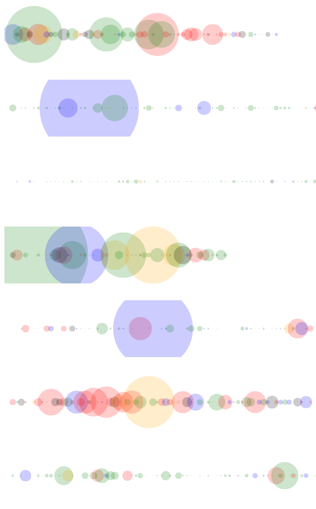

# apstlog
app store log viewer

## Required

- go 1.8
- GCP Account
- Cloud SDK

# How to Build

## Install

```console
$ go get github.com/itsubaki/apstlib
$ git clone https://github.com/itsubaki/apstlog.git
```

## Setting

```javascript
// asset/js/variable.js
var base_url = "https://${PRODJECT_ID}.appspot.com"
var tracking_code = "${GOOGLE_ANALYTICS_TRACKING_CODE}"
// or remove google analytics snippet in apstlog.js
```

## Make GAE Application

See [apstlib](https://github.com/itsubaki/apstlib.git)

## Sample

 - color: green(Rating:5), blue(4), black(3), orange(2), red(1)
 - radius: review comment length
 - x axis: time series(new <-------> old)



